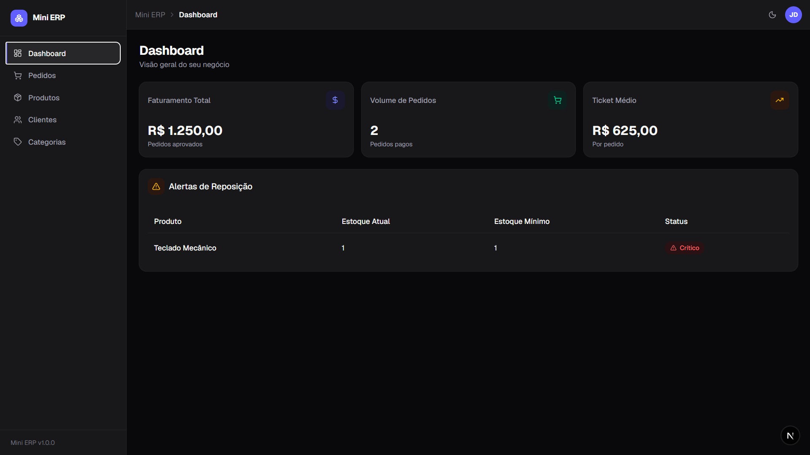
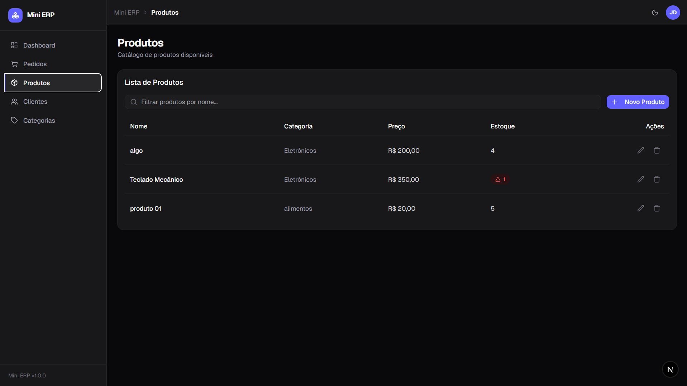
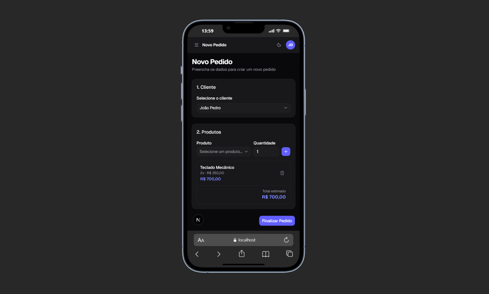
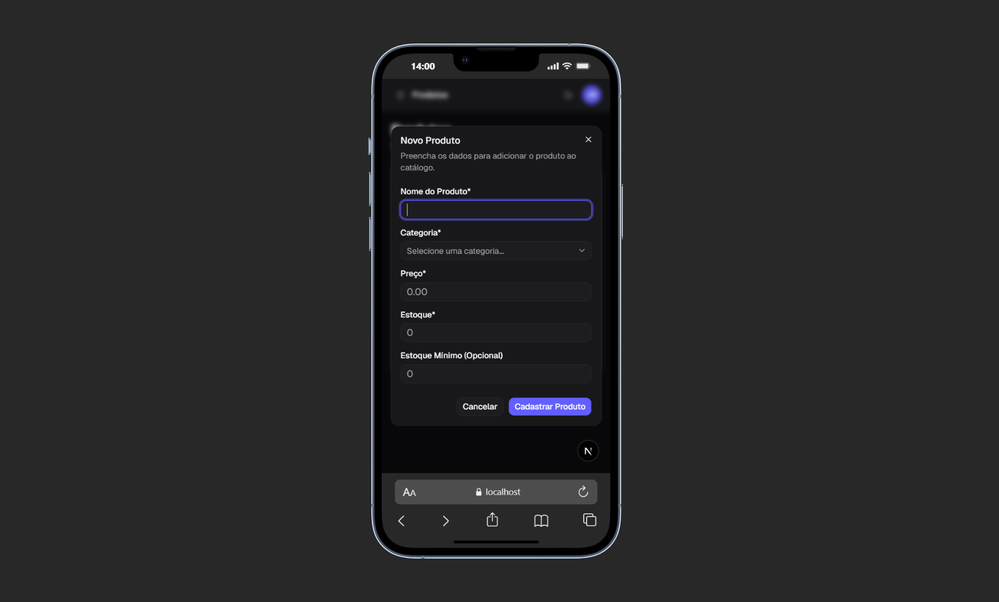

<div align="center">

# 📦 Mini-ERP - Sistema de Gestão Integrada

**Aplicação full-stack de gerenciamento interno voltada para o controle e fluxo comercial de empresas, englobando a gestão de produtos, categorias, clientes e a emissão complexa de pedidos de venda com múltiplos itens.**

[](https://openjdk.org/)
[](https://spring.io/projects/spring-boot)
[](https://www.postgresql.org/)
[](https://nextjs.org/)
[](https://www.typescriptlang.org/)
[](https://tailwindcss.com/)

</div>

---

## ✨ Funcionalidades

- **Gestão de Pedidos Inteligente** — Emissão de pedidos com múltiplos itens, cálculo automático de subtotais e valor total, e controle de fluxo de status (`RASCUNHO → PAGO / CANCELADO`), com máquina de estados robusta protegida por regras de negócio transacionais.

- **Painel de Métricas (Dashboard)** — Cards analíticos em tempo real de Faturamento Total, Volume de Pedidos e Ticket Médio, acompanhados de um painel crítico de **Alertas de Reposição de Estoque**, sinalizando produtos abaixo do mínimo cadastrado.

- **Catálogo de Produtos e Categorias** — Organização de produtos com controle rígido de estoque mínimo, preços e categorização relacional com integridade referencial garantida pelo banco de dados.

- **Engenharia de Responsividade Avançada** — Layout adaptativo que converte tabelas ricas do desktop em mini-cards empilhados no mobile, garantindo usabilidade plena em qualquer tamanho de tela.

- **Modo Escuro / Claro Nativo** — Alternância fluida entre temas com persistência de preferência, sem flash de conteúdo não estilizado (FOUC).

---

## 🛠️ Tecnologias Utilizadas

### Backend (`mini-erp/`)

| Tecnologia      | Versão | Função                                                          |
| --------------- | ------ | --------------------------------------------------------------- |
| Java            | 17     | Linguagem principal                                             |
| Spring Boot     | 3.x    | Framework base e auto-configuração                              |
| Spring Data JPA | —      | Abstração de repositórios e consultas                           |
| Hibernate       | —      | ORM / mapeamento entidade-tabela                                |
| PostgreSQL      | Latest | Banco de dados relacional                                       |
| Maven           | —      | Gerenciamento de dependências e build                           |
| Lombok          | —      | Eliminação de boilerplate (`@Data`, `@RequiredArgsConstructor`) |
| UUID            | —      | Identificadores únicos universais para entidades                |

### Frontend (`mini-erp-front/`)

| Tecnologia           | Versão          | Função                                             |
| -------------------- | --------------- | -------------------------------------------------- |
| Next.js              | 15 (App Router) | Framework React com roteamento baseado em arquivos |
| React                | 19              | Biblioteca de UI com Server e Client Components    |
| TypeScript           | 5               | Tipagem estática e contratos de dados              |
| Tailwind CSS         | v4              | Estilização utility-first                          |
| Shadcn/ui (Radix UI) | —               | Componentes acessíveis e altamente customizáveis   |
| Lucide React         | —               | Biblioteca de ícones SVG coerentes e leves         |
| Sonner               | —               | Notificações toast não intrusivas                  |

---

## 🏗️ Diagrama de Arquitetura

```
┌─────────────────────────────────────────────────────────────────┐
│                   FRONTEND — localhost:3000                      │
│                      (Next.js 15 / React 19)                    │
│                                                                  │
│   Dashboard  │  Produtos  │  Pedidos  │  Clientes  │ Categorias  │
└──────────────────────────────┬──────────────────────────────────┘
                               │
                               │  HTTP/REST  ·  JSON
                               │  CORS centralizado (CorsConfig.java)
                               │
                               │  GET  /api/produtos
                               │  POST /api/produtos
                               │  GET  /api/pedidos
                               │  POST /api/pedidos
                               │  PUT  /api/pedidos/{id}
                               │  DELETE /api/pedidos/{id}
                               │
┌──────────────────────────────▼──────────────────────────────────┐
│                  BACKEND — localhost:8080                        │
│                 (Spring Boot · Maven · Java 17)                  │
│                                                                  │
│  ┌─────────────┐    ┌─────────────┐    ┌──────────────────────┐ │
│  │  Controller │───▶│   Service   │───▶│     Repository       │ │
│  │  (REST API) │    │ (Regras de  │    │  (Spring Data JPA)   │ │
│  │             │◀───│  Negócio)   │◀───│                      │ │
│  └─────────────┘    └─────────────┘    └──────────┬───────────┘ │
│                                                   │             │
│  ┌────────────────────────────────────────────────▼───────────┐ │
│  │              Domain (Entidades JPA + Enums)                 │ │
│  │  Produto · Pedido · PedidoItem · Cliente · Categoria       │ │
│  └────────────────────────────────────────────────────────────┘ │
└──────────────────────────────┬──────────────────────────────────┘
                               │
                               │  JDBC / Hibernate ORM
                               │
┌──────────────────────────────▼──────────────────────────────────┐
│               BANCO DE DADOS — PostgreSQL                        │
│                    (database: mini-erp)                          │
│                                                                  │
│   produtos · pedidos · pedido_itens · clientes · categorias     │
└─────────────────────────────────────────────────────────────────┘
```

---

## 🔌 Documentação da API (Exemplos Práticos)

### `GET /api/produtos` — Listar Produtos

Retorna todos os produtos cadastrados, incluindo o objeto de categoria aninhado e os dados de controle de estoque.

**Response `200 OK`:**

```json
[
  {
    "id": "a1b2c3d4-e5f6-7890-abcd-ef1234567890",
    "nome": "Notebook Pro 15",
    "preco": 4599.9,
    "estoque": 12,
    "estoqueMinimo": 5,
    "categoria": {
      "id": "f9e8d7c6-b5a4-3210-fedc-ba9876543210",
      "nome": "Eletrônicos"
    }
  },
  {
    "id": "b2c3d4e5-f6a7-8901-bcde-f12345678901",
    "nome": "Mouse Ergonômico",
    "preco": 189.9,
    "estoque": 3,
    "estoqueMinimo": 10,
    "categoria": {
      "id": "f9e8d7c6-b5a4-3210-fedc-ba9876543210",
      "nome": "Eletrônicos"
    }
  }
]
```

> **Alerta de Reposição:** Produtos onde `estoque < estoqueMinimo` são destacados automaticamente no Dashboard como itens críticos.

---

### `POST /api/pedidos` — Criar Pedido

Cria um novo pedido em status `RASCUNHO`. O backend valida o estoque de cada item, calcula o subtotal por linha e o valor total do pedido de forma transacional.

**Request Body:**

```json
{
  "clienteId": "c3d4e5f6-a7b8-9012-cdef-123456789012",
  "itens": [
    {
      "produtoId": "a1b2c3d4-e5f6-7890-abcd-ef1234567890",
      "quantidade": 2
    },
    {
      "produtoId": "b2c3d4e5-f6a7-8901-bcde-f12345678901",
      "quantidade": 1
    }
  ]
}
```

**Response `201 Created`:**

```json
{
  "id": "d4e5f6a7-b8c9-0123-defa-234567890123",
  "status": "RASCUNHO",
  "valorTotal": 9389.7,
  "cliente": {
    "id": "c3d4e5f6-a7b8-9012-cdef-123456789012",
    "nome": "Empresa XYZ Ltda."
  },
  "itens": [
    {
      "produtoId": "a1b2c3d4-e5f6-7890-abcd-ef1234567890",
      "nomeProduto": "Notebook Pro 15",
      "quantidade": 2,
      "precoUnitario": 4599.9,
      "subtotal": 9199.8
    },
    {
      "produtoId": "b2c3d4e5-f6a7-8901-bcde-f12345678901",
      "nomeProduto": "Mouse Ergonômico",
      "quantidade": 1,
      "precoUnitario": 189.9,
      "subtotal": 189.9
    }
  ]
}
```

### Tabela Completa de Endpoints

| Método   | Endpoint             | Descrição                             |
| -------- | -------------------- | ------------------------------------- |
| `GET`    | `/api/produtos`      | Lista todos os produtos com categoria |
| `POST`   | `/api/produtos`      | Cadastra novo produto                 |
| `PUT`    | `/api/produtos/{id}` | Atualiza produto existente            |
| `DELETE` | `/api/produtos/{id}` | Remove produto (valida integridade)   |
| `GET`    | `/api/pedidos`       | Lista todos os pedidos                |
| `POST`   | `/api/pedidos`       | Cria pedido com validação de estoque  |
| `PUT`    | `/api/pedidos/{id}`  | Atualiza pedido em `RASCUNHO`         |
| `DELETE` | `/api/pedidos/{id}`  | Cancela pedido e restaura estoque     |
| `GET`    | `/api/clientes`      | Lista todos os clientes               |
| `POST`   | `/api/clientes`      | Cadastra novo cliente                 |
| `GET`    | `/api/categorias`    | Lista todas as categorias             |
| `POST`   | `/api/categorias`    | Cadastra nova categoria               |

---

## 📁 Estrutura do Projeto

```
mini-erp/                          # Workspace raiz (monorepo)
│
├── mini-erp/                      # Módulo Backend — Spring Boot
│   └── src/main/java/com/.../
│       ├── controller/            # Endpoints REST (Produto, Pedido, Cliente, Categoria)
│       ├── domain/                # Entidades JPA, Enums (StatusPedido) e relacionamentos
│       ├── dto/                   # Records de Request/Response (contrato da API)
│       ├── exception/             # Hierarquia de exceções e GlobalExceptionHandler
│       ├── repository/            # Interfaces Spring Data JPA
│       └── service/               # Regras de negócio, cálculos e transações
│
└── mini-erp-front/                # Módulo Frontend — Next.js 15
    └── src/app/
        ├── (pages)/               # Rotas do App Router (dashboard, produtos, pedidos...)
        ├── components/            # Componentes reutilizáveis (tabelas, cards, modais)
        └── lib/                   # Clientes HTTP, utilitários e tipagens TypeScript
```

---

## 🚀 Como Executar Localmente

### Pré-requisitos

- Java 17+
- Maven 3.x
- PostgreSQL rodando localmente
- Node.js 20+ e npm

---

### 1. Banco de Dados

Crie o banco de dados no PostgreSQL:

```sql
CREATE DATABASE "mini-erp";
```

---

### 2. Backend (Spring Boot)

**Configure as variáveis de ambiente** na sessão do terminal antes de executar:

```powershell
# PowerShell
$env:DB_URL      = "jdbc:postgresql://localhost:5432/mini-erp"
$env:DB_USERNAME = "seu_usuario_postgres"
$env:DB_PASSWORD = "sua_senha_postgres"
$env:CORS_ALLOWED_ORIGINS = "http://localhost:3000"
```

> **Segurança:** Nenhuma credencial está hardcoded no código-fonte. O `application.properties` usa exclusivamente referências dinâmicas a variáveis de ambiente (`${DB_PASSWORD}`, `${DB_URL}`, etc.), garantindo que o projeto seja seguro para hospedagem em nuvem e repositórios públicos.

**Execute o backend:**

```bash
cd mini-erp
./mvnw spring-boot:run
```

O servidor iniciará em `http://localhost:8080`. O Hibernate criará as tabelas automaticamente no primeiro run via DDL automático.

---

### 3. Frontend (Next.js)

**Crie o arquivo `.env.local`** dentro da pasta `mini-erp-front/`:

```bash
# mini-erp-front/.env.local
NEXT_PUBLIC_API_URL=http://localhost:8080
```

**Instale as dependências e execute:**

```bash
cd mini-erp-front
npm install
npm run dev
```

O frontend estará disponível em `http://localhost:3000`.

---

## 📸 Screenshots

### Desktop

<table>
  <tr>
    <td align="center" width="50%">
      <strong>Painel Geral de Métricas e Estoque</strong><br/><br/>
      
    </td>
    <td align="center" width="50%">
      <strong>Catálogo de Produtos e Ações</strong><br/><br/>
      
    </td>
  </tr>
</table>

### Mobile

<table>
  <tr>
    <td align="center" width="50%">
      <strong>Fluxo Responsivo de Emissão de Pedidos</strong><br/><br/>
      
    </td>
    <td align="center" width="50%">
      <strong>Formulários Adaptados para Telas Pequenas</strong><br/><br/>
      
    </td>
  </tr>
</table>

---

## 🤖 Papel da IA vs. Foco Real do Projeto

> Esta seção é fundamental para compreender as escolhas de engenharia e o que este projeto realmente demonstra.

### Frontend — Aceleração Estratégica com IA

O uso de Inteligência Artificial (Claude) foi **deliberadamente restrito** ao ecossistema de Frontend, atuando como ferramenta de **aceleração de prototipagem**, não de substituição de raciocínio técnico:

- **Prototipagem ágil** de layouts, estrutura de componentes e páginas em Next.js e TypeScript.
- **Consistência de temas** — aplicação coerente de tokens de cores e classes do Tailwind CSS v4 no Light e Dark Mode.
- **Adaptação de responsividade** — conversão cirúrgica de tabelas desktop em mini-cards empilhados para dispositivos móveis com Shadcn/ui.

### Backend — 100% Artesanal e o Principal Foco de Avaliação

O verdadeiro coração técnico e diferencial deste projeto é o **Backend em Java Spring Boot**, desenvolvido de forma **completamente manual**, sem nenhuma assistência de IA, para demonstrar domínio sólido em:

- **Regras de negócio complexas** — validação transacional de estoque com `@Transactional`, cálculo automático do valor total do pedido linha a linha, e estorno de estoque no cancelamento.
- **Máquina de estados rigorosa** — um pedido só pode ser pago se estiver em `RASCUNHO`; um pedido já cancelado não pode ser cancelado novamente — tudo protegido por `BusinessException` com mensagens claras.
- **Tratamento global de exceções** com `@RestControllerAdvice`, respondendo sempre com um `StandardError` padronizado (timestamp, status, mensagem) — **zero stack trace exposto** ao consumidor da API.
- **Segurança arquitetural** — credenciais 100% externalizadas via variáveis de ambiente e CORS centralizado em `CorsConfig.java`, sem `@CrossOrigin` disperso nos controllers.

---

## 👤 Autor

Desenvolvido por **João Pedro**

[](https://www.linkedin.com/in/soujoaopedro)
[](https://github.com/soujoaopedro)
